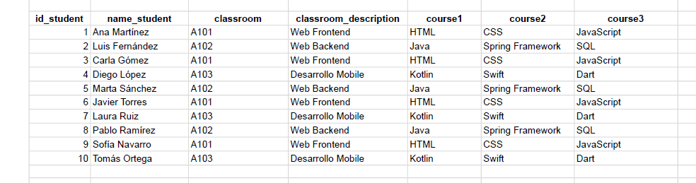
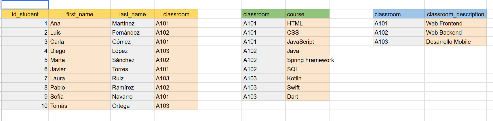
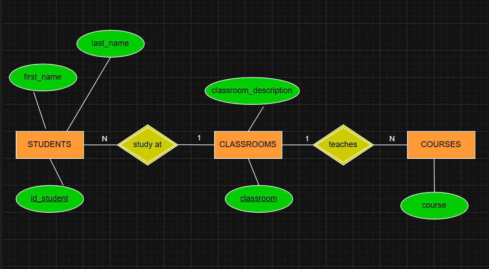
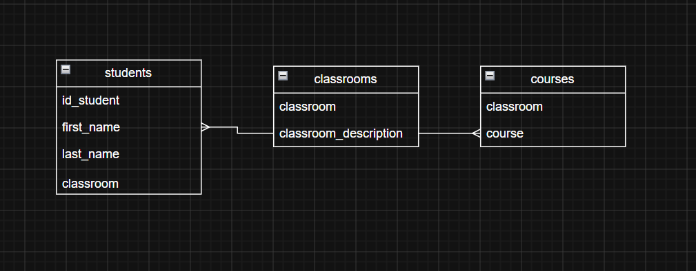

## Descripción del ejercicio

Este ejercicio consiste en normalizar una base de datos que relaciona alumnos, aulas y cursos. La tabla original presentaba varios problemas de diseño:

- Las columnas `course1`, `course2`, `course3` formaban un grupo de repetición (violación de 1FN).
- El campo `classroom_description` y los cursos dependían del aula(`classroom`), no del alumno directamente, generando dependencias transitivas (violación de 3FN).

Tras aplicar las reglas de normalización (1FN, 2FN y 3FN), la base de datos quedó dividida en tres tablas:

- **students**: `id_student` (PK), `first_name`, `last_name`
- **classrooms**: `classroom` (PK), `classroom_description`
- **classroom_courses**: `course`

## Tabla original sin normalizar

## Tabla normalizada

La tabla normalizada (1FN, 2FN, 3FN) se encuentra en Google Sheets:
[Ver tabla normalizada](https://docs.google.com/spreadsheets/d/19ZzYR9UQAo2GZovq3YB7STDMPHqkWdeq7d-2LLrsMFY/edit?usp=sharing)

## Diagrama Entidad-Relación (Notación de Chen)

## Diagrama de patas de gallo (UML)

